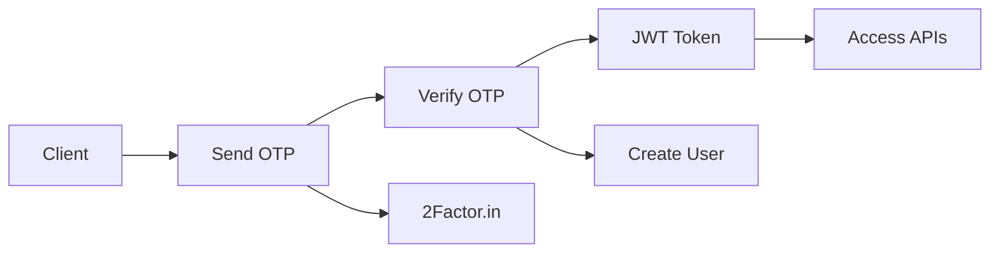
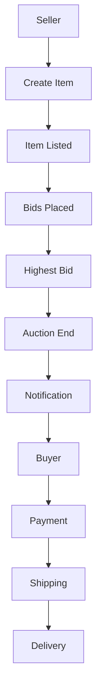
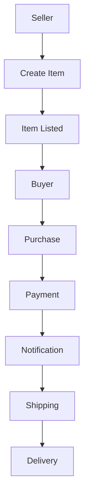
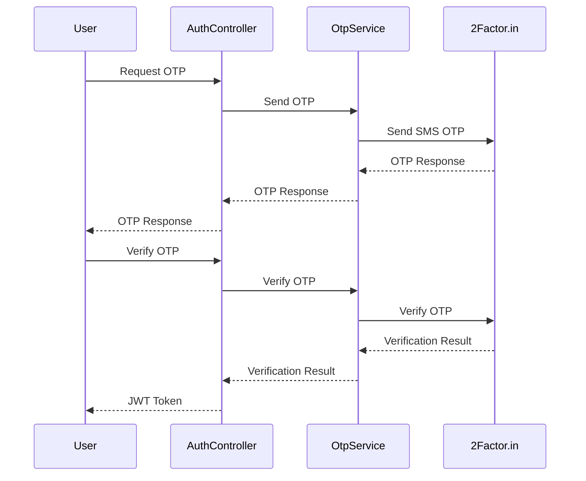
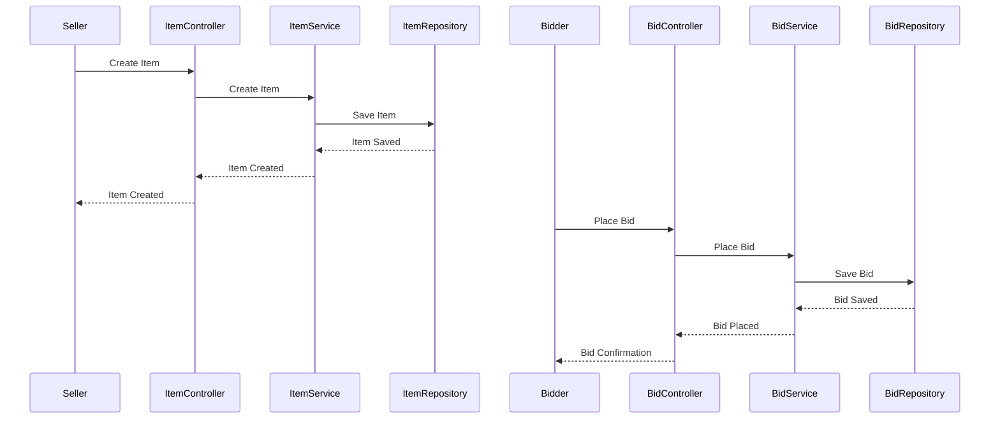
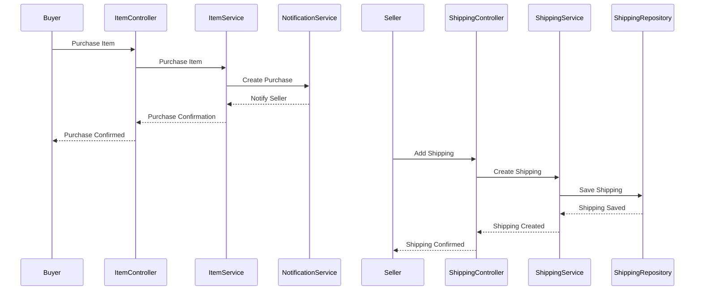

# ThreadBit Backend

ThreadBit is a comprehensive e-commerce platform for second-hand clothing, featuring both auction and instant buy functionality. This repository contains the backend API built with Spring Boot and MongoDB.

## Table of Contents
- [Overview](#overview)
- [Features](#features)
- [Technology Stack](#technology-stack)
- [Setup Instructions](#setup-instructions)
- [Application Structure](#application-structure)
- [Database Schema](#database-schema)
- [API Documentation](#api-documentation)
- [Flow Diagrams](#flow-diagrams)
- [Sequence Diagrams](#sequence-diagrams)

## Overview

ThreadBit is a platform that allows users to buy and sell second-hand clothing items. The platform supports two primary transaction models:
1. **Auction-based sales**: Users can list items for auction with a starting price and end time
2. **Instant Buy**: Users can list items with a fixed price for immediate purchase

The backend provides a comprehensive API for user management, item listing, bidding, purchasing, payment processing, and notifications.

## Features

- **User Management**
  - Phone number verification via OTP
  - JWT-based authentication
  - User profiles with social media links

- **Item Management**
  - Create, read, update, and delete item listings
  - Support for both auction and instant buy items
  - Image upload for item listings
  - Categorization and filtering

- **Bidding System**
  - Place bids on auction items
  - Automatic auction completion
  - Notifications for bid events

- **Purchase System**
  - Instant buy functionality
  - Transaction records
  - Shipping tracking

- **Payment Integration**
  - Razorpay integration for secure payments
  - Wallet balance management
  - Bank account management for sellers

- **Notification System**
  - Email notifications
  - In-app notifications for various events

## Technology Stack

- **Framework**: Spring Boot 3.3.2
- **Database**: MongoDB
- **Authentication**: JWT (JSON Web Tokens)
- **Documentation**: Swagger/OpenAPI
- **Email Service**: Spring Mail with Gmail SMTP
- **SMS Service**: 2Factor.in API
- **Payment Gateway**: Razorpay
- **Build Tool**: Maven

## Setup Instructions

### Prerequisites
- Java 17 or higher
- Maven
- MongoDB (local or Atlas)

### Configuration

1. **Clone the repository**
   ```bash
   git clone <repository-url>
   cd therapist_backend
   ```

2. **Configure application.properties**

   The application uses various external services. You'll need to configure the following properties:

   - MongoDB connection
   - Email service credentials
   - 2Factor.in API key
   - Razorpay credentials
   - JWT secret key

   Example configuration is available in `src/main/resources/application.properties`

3. **Build the application**
   ```bash
   mvn clean install
   ```

4. **Run the application**
   ```bash
   mvn spring-boot:run
   ```

### Accessing Swagger UI

The API documentation is available through Swagger UI at:
```
https://hammerhead-app-zgpcv.ondigitalocean.app/swagger-ui/index.html
```

For local development, access Swagger at:
```
http://localhost:8080/swagger-ui/index.html
```

## Application Structure

The application follows a standard Spring Boot architecture with the following components:

```
src/main/java/com/backend/threadbit/
├── config/                  # Configuration classes
│   ├── JwtConfig.java       # JWT configuration
│   └── SecurityConfig.java  # Security configuration
├── controller/              # REST controllers
│   ├── AuthController.java  # Authentication endpoints
│   ├── ItemController.java  # Item management endpoints
│   └── ...
├── dto/                     # Data Transfer Objects
│   ├── ItemDto.java
│   ├── PurchaseDto.java
│   └── ...
├── model/                   # Domain models
│   ├── User.java
│   ├── Item.java
│   ├── Bid.java
│   ├── Purchase.java
│   └── ...
├── repository/              # MongoDB repositories
│   ├── UserRepository.java
│   ├── ItemRepository.java
│   └── ...
├── service/                 # Business logic
│   ├── UserService.java
│   ├── ItemService.java
│   ├── AuctionCompletionService.java
│   ├── NotificationService.java
│   └── ...
└── ThreadBitBackendApplication.java  # Main application class
```

## Database Schema

ThreadBit uses MongoDB as its database. The main collections are:

### Users Collection
```json
{
  "id": "string",
  "username": "string",
  "name": "string",
  "walletBalance": "string",
  "phoneNumber": "string",
  "socialMedia": [{"key": "value"}],
  "email": "string",
  "isVerified": "boolean",
  "description": "string",
  "avatarUrl": "string",
  "createdAt": "datetime"
}
```

### Items Collection
```json
{
  "id": "string",
  "title": "string",
  "description": "string",
  "brand": "string",
  "size": "enum(Size)",
  "condition": "enum(Condition)",
  "color": "string",
  "startingPrice": "double",
  "currentPrice": "double",
  "imageUrls": ["string"],
  "sellerId": "string",
  "categoryId": "integer",
  "endTime": "datetime",
  "createdAt": "datetime",
  "status": "enum(Status)",
  "itemType": "enum(ItemType)",
  "stockQuantity": "integer",
  "soldQuantity": "integer",
  "originalPrice": "integer",
  "buyNowPrice": "integer"
}
```

### Bids Collection
```json
{
  "id": "string",
  "itemId": "string",
  "userId": "string",
  "amount": "double",
  "createdAt": "datetime"
}
```

### Purchases Collection
```json
{
  "id": "string",
  "itemId": "string",
  "buyerId": "string",
  "quantity": "integer",
  "pricePerUnit": "integer",
  "totalPrice": "integer",
  "purchaseDate": "datetime",
  "status": "enum(Status)"
}
```

### Transactions Collection
```json
{
  "id": "string",
  "userId": "string",
  "bankAccountId": "string",
  "type": "enum(TransactionType)",
  "amount": "bigdecimal",
  "currency": "string",
  "status": "enum(TransactionStatus)",
  "referenceId": "string",
  "description": "string",
  "razorpayPaymentId": "string",
  "createdAt": "datetime",
  "updatedAt": "datetime"
}
```

### Bank Accounts Collection
```json
{
  "id": "string",
  "accountType": "enum(AccountType)",
  "accountNumber": "string",
  "accountHolderName": "string",
  "bankName": "string",
  "ifscCode": "string",
  "upiId": "string",
  "userId": "string",
  "isActive": "boolean",
  "isPrimary": "boolean",
  "createdAt": "datetime",
  "updatedAt": "datetime"
}
```

### Shipping Records Collection
```json
{
  "id": "string",
  "itemId": "string",
  "purchaseId": "string",
  "bidId": "string",
  "sellerId": "string",
  "buyerId": "string",
  "trackingNumber": "string",
  "carrier": "string",
  "shippingMethod": "string",
  "additionalNotes": "string",
  "receiptImageUrl": "string",
  "createdAt": "datetime",
  "updatedAt": "datetime",
  "status": "enum(ShippingStatus)"
}
```

## API Documentation

The API is documented using Swagger/OpenAPI. You can access the full API documentation at:

```
https://hammerhead-app-zgpcv.ondigitalocean.app/swagger-ui/index.html
```

### Key API Endpoints

#### Authentication
- `POST /api/auth/send-otp`: Send OTP for phone verification
- `POST /api/auth/verify-number`: Verify OTP and authenticate user

#### Items
- `GET /api/items`: Get all items with optional filtering
- `GET /api/items/{id}`: Get item by ID
- `POST /api/items`: Create a new auction item
- `POST /api/items/instant-buy`: Create a new instant buy item
- `PATCH /api/items/{id}/status`: Update item status

#### Purchases
- `POST /api/items/purchase`: Purchase an instant buy item
- `GET /api/items/purchases/{buyerId}`: Get purchases by buyer ID

#### Bids
- `POST /api/bids`: Place a bid on an auction item
- `GET /api/bids/item/{itemId}`: Get all bids for an item
- `GET /api/bids/user/{userId}`: Get all bids by a user

#### Users
- `GET /api/users/{id}`: Get user by ID
- `GET /api/users/exist/{username}`: Check if username exists
- `PATCH /api/users/{id}`: Update user profile

## Flow Diagrams

### User Registration and Authentication Flow


### Auction Item Flow


### Instant Buy Flow


## Sequence Diagrams

### User Authentication Sequence


### Item Creation and Bidding Sequence


### Purchase and Shipping Sequence


---

This README provides a comprehensive overview of the ThreadBit backend application. For more detailed information, please refer to the code documentation and Swagger UI https://threadbit-fjn35.ondigitalocean.app/swagger-ui/index.html#/.
