# ThreadBit Backend

ThreadBit is a comprehensive e-commerce platform for second-hand clothing, featuring both auction and instant buy functionality. This repository contains the backend API built with Spring Boot and MongoDB.

## 📊 Quick Stats
- **6** Core Collections
- **15+** API Endpoints  
- **3** External Service Integrations
- **2** Business Models (Auction + Instant Buy)

## Table of Contents
- [Overview](#overview)
- [Features](#features)
- [Technology Stack](#technology-stack)
- [Setup Instructions](#setup-instructions)
- [Application Structure](#application-structure)
- [Database Schema](#database-schema)
- [API Documentation](#api-documentation)
- [Architecture Diagrams](#architecture-diagrams)
- [Flow Diagrams](#flow-diagrams)
- [Sequence Diagrams](#sequence-diagrams)

## Overview

ThreadBit is a platform that allows users to buy and sell second-hand clothing items. The platform supports two primary transaction models:
1. **🏷️ Auction-based sales**: Users can list items for auction with a starting price and end time
2. **⚡ Instant Buy**: Users can list items with a fixed price for immediate purchase

The backend provides a comprehensive API for user management, item listing, bidding, purchasing, payment processing, and notifications.

## Features

- **👤 User Management**
  - Phone number verification via OTP
  - JWT-based authentication
  - User profiles with social media links

- **📦 Item Management**
  - Create, read, update, and delete item listings
  - Support for both auction and instant buy items
  - Image upload for item listings
  - Categorization and filtering

- **💰 Bidding System**
  - Place bids on auction items
  - Automatic auction completion
  - Notifications for bid events

- **🛒 Purchase System**
  - Instant buy functionality
  - Transaction records
  - Shipping tracking

- **💳 Payment Integration**
  - Razorpay integration for secure payments
  - Wallet balance management
  - Bank account management for sellers

- **📧 Notification System**
  - Email notifications
  - In-app notifications for various events

## Technology Stack

- **Framework**: Spring Boot 3.3.2
- **Database**: MongoDB
- **Authentication**: JWT (JSON Web Tokens)
- **Documentation**: Swagger/OpenAPI
- **Email Service**: Spring Mail with Gmail SMTP
- **SMS Service**: 2Factor.in API
- **Payment Gateway**: Razorpay
- **Build Tool**: Maven

## Setup Instructions

### Prerequisites
- Java 17 or higher
- Maven
- MongoDB (local or Atlas)

### Configuration

1. **Clone the repository**
   ```bash
   git clone <repository-url>
   cd threadbit_backend
   ```

2. **Configure application.properties**

   The application uses various external services. You'll need to configure the following properties:

   - MongoDB connection
   - Email service credentials
   - 2Factor.in API key
   - Razorpay credentials
   - JWT secret key

   Example configuration is available in `src/main/resources/application.properties`

3. **Build the application**
   ```bash
   mvn clean install
   ```

4. **Run the application**
   ```bash
   mvn spring-boot:run
   ```

### Accessing Swagger UI

The API documentation is available through Swagger UI at:
```
https://threadbit-fjn35.ondigitalocean.app/swagger-ui/index.html
```

For local development, access Swagger at:
```
http://localhost:8080/swagger-ui/index.html
```

## Application Structure

The application follows a standard Spring Boot architecture with the following components:

```
src/main/java/com/backend/threadbit/
├── config/                  # Configuration classes
│   ├── JwtConfig.java       # JWT configuration
│   └── SecurityConfig.java  # Security configuration
├── controller/              # REST controllers
│   ├── AuthController.java  # Authentication endpoints
│   ├── ItemController.java  # Item management endpoints
│   └── ...
├── dto/                     # Data Transfer Objects
│   ├── ItemDto.java
│   ├── PurchaseDto.java
│   └── ...
├── model/                   # Domain models
│   ├── User.java
│   ├── Item.java
│   ├── Bid.java
│   ├── Purchase.java
│   └── ...
├── repository/              # MongoDB repositories
│   ├── UserRepository.java
│   ├── ItemRepository.java
│   └── ...
├── service/                 # Business logic
│   ├── UserService.java
│   ├── ItemService.java
│   ├── AuctionCompletionService.java
│   ├── NotificationService.java
│   └── ...
└── ThreadBitBackendApplication.java  # Main application class
```

## Database Schema

ThreadBit uses MongoDB as its database. The main collections are:

### Users Collection
```json
{
  "id": "string",
  "username": "string",
  "name": "string",
  "walletBalance": "string",
  "phoneNumber": "string",
  "socialMedia": [{"key": "value"}],
  "email": "string",
  "isVerified": "boolean",
  "description": "string",
  "avatarUrl": "string",
  "createdAt": "datetime"
}
```

### Items Collection
```json
{
  "id": "string",
  "title": "string",
  "description": "string",
  "brand": "string",
  "size": "enum(Size)",
  "condition": "enum(Condition)",
  "color": "string",
  "startingPrice": "double",
  "currentPrice": "double",
  "imageUrls": ["string"],
  "sellerId": "string",
  "categoryId": "integer",
  "endTime": "datetime",
  "createdAt": "datetime",
  "status": "enum(Status)",
  "itemType": "enum(ItemType)",
  "stockQuantity": "integer",
  "soldQuantity": "integer",
  "originalPrice": "integer",
  "buyNowPrice": "integer"
}
```

### Bids Collection
```json
{
  "id": "string",
  "itemId": "string",
  "userId": "string",
  "amount": "double",
  "createdAt": "datetime"
}
```

### Purchases Collection
```json
{
  "id": "string",
  "itemId": "string",
  "buyerId": "string",
  "quantity": "integer",
  "pricePerUnit": "integer",
  "totalPrice": "integer",
  "purchaseDate": "datetime",
  "status": "enum(Status)"
}
```

### Transactions Collection
```json
{
  "id": "string",
  "userId": "string",
  "bankAccountId": "string",
  "type": "enum(TransactionType)",
  "amount": "bigdecimal",
  "currency": "string",
  "status": "enum(TransactionStatus)",
  "referenceId": "string",
  "description": "string",
  "razorpayPaymentId": "string",
  "createdAt": "datetime",
  "updatedAt": "datetime"
}
```

### Bank Accounts Collection
```json
{
  "id": "string",
  "accountType": "enum(AccountType)",
  "accountNumber": "string",
  "accountHolderName": "string",
  "bankName": "string",
  "ifscCode": "string",
  "upiId": "string",
  "userId": "string",
  "isActive": "boolean",
  "isPrimary": "boolean",
  "createdAt": "datetime",
  "updatedAt": "datetime"
}
```

### Shipping Records Collection
```json
{
  "id": "string",
  "itemId": "string",
  "purchaseId": "string",
  "bidId": "string",
  "sellerId": "string",
  "buyerId": "string",
  "trackingNumber": "string",
  "carrier": "string",
  "shippingMethod": "string",
  "additionalNotes": "string",
  "receiptImageUrl": "string",
  "createdAt": "datetime",
  "updatedAt": "datetime",
  "status": "enum(ShippingStatus)"
}
```

## API Documentation

The API is documented using Swagger/OpenAPI. You can access the full API documentation at:

```
https://threadbit-fjn35.ondigitalocean.app/swagger-ui/index.html
```

### Key API Endpoints

#### Authentication
- `POST /api/auth/send-otp`: Send OTP for phone verification
- `POST /api/auth/verify-number`: Verify OTP and authenticate user

#### Items
- `GET /api/items`: Get all items with optional filtering
- `GET /api/items/{id}`: Get item by ID
- `POST /api/items`: Create a new auction item
- `POST /api/items/instant-buy`: Create a new instant buy item
- `PATCH /api/items/{id}/status`: Update item status

#### Purchases
- `POST /api/items/purchase`: Purchase an instant buy item
- `GET /api/items/purchases/{buyerId}`: Get purchases by buyer ID

#### Bids
- `POST /api/bids`: Place a bid on an auction item
- `GET /api/bids/item/{itemId}`: Get all bids for an item
- `GET /api/bids/user/{userId}`: Get all bids by a user

#### Users
- `GET /api/users/{id}`: Get user by ID
- `GET /api/users/exist/{username}`: Check if username exists
- `PATCH /api/users/{id}`: Update user profile

## Architecture Diagrams

### 🏗️ System Architecture Overview


### 🗄️ Database Schema & Relationships


## Flow Diagrams

### 🔐 User Authentication & Registration Flow

```mermaid
flowchart TD
    START([👤 User Opens App]) --> PHONE[📱 Enter Phone Number]
    PHONE --> SEND_OTP[📤 Send OTP Request]
    SEND_OTP --> TWOFACTOR[📱 2Factor.in API]
    TWOFACTOR --> SMS[📲 SMS Sent]
    SMS --> ENTER_OTP[🔢 Enter OTP]
    
    ENTER_OTP --> VERIFY{✅ Verify OTP}
    VERIFY -->|Invalid| OTP_ERROR[❌ Invalid OTP]
    OTP_ERROR --> ENTER_OTP
    
    VERIFY -->|Valid - First Time| NEW_USER[🆕 Create Profile]
    NEW_USER --> USER_DETAILS[📝 Enter User Details]
    USER_DETAILS --> SAVE_USER[💾 Save to Database]
    
    VERIFY -->|Valid - Existing User| EXISTING_USER[👤 Load User Profile]
    
    SAVE_USER --> GENERATE_JWT[🎫 Generate JWT Token]
    EXISTING_USER --> GENERATE_JWT
    GENERATE_JWT --> SUCCESS[✅ Authentication Success]
    SUCCESS --> ACCESS[🚀 Access App Features]
    
    style START fill:#e1f5fe,stroke:#0277bd,stroke-width:3px
    style SUCCESS fill:#e8f5e8,stroke:#2e7d32,stroke-width:3px
    style OTP_ERROR fill:#ffebee,stroke:#c62828,stroke-width:2px
    style TWOFACTOR fill:#fff3e0,stroke:#ef6c00,stroke-width:2px
    style GENERATE_JWT fill:#f3e5f5,stroke:#7b1fa2,stroke-width:2px
```

### 🏷️ Complete Auction Flow

```mermaid
flowchart TD
    START([👤 Seller Creates Auction]) --> CREATE[📝 Create Auction Item]
    CREATE --> VALIDATE{✅ Validate Item Data}
    VALIDATE -->|Invalid| ERROR[❌ Return Error]
    VALIDATE -->|Valid| SAVE[💾 Save to Database]
    
    SAVE --> LIVE[🔴 Auction Goes Live]
    LIVE --> BROWSE[👥 Buyers Browse Items]
    
    BROWSE --> BID_START[💰 First Bid Placed]
    BID_START --> BID_LOOP{🔄 More Bids?}
    BID_LOOP -->|Yes| BID_VALIDATE{✅ Bid Valid?}
    BID_VALIDATE -->|No| BID_ERROR[❌ Bid Error]
    BID_VALIDATE -->|Yes| UPDATE_PRICE[📈 Update Current Price]
    UPDATE_PRICE --> NOTIFY_USERS[📧 Notify All Bidders]
    NOTIFY_USERS --> BID_LOOP
    
    BID_LOOP -->|Auction Ends| TIME_END[⏰ End Time Reached]
    TIME_END --> CHECK_BIDS{💰 Any Bids?}
    
    CHECK_BIDS -->|No Bids| UNSOLD[📦 Mark as Unsold]
    CHECK_BIDS -->|Has Bids| WINNER[🏆 Determine Winner]
    
    WINNER --> NOTIFY_WINNER[📧 Notify Winner & Seller]
    NOTIFY_WINNER --> PAYMENT[💳 Payment Processing]
    PAYMENT --> SHIP_SETUP[📦 Setup Shipping]
    SHIP_SETUP --> TRACKING[📍 Add Tracking Info]
    TRACKING --> COMPLETE[✅ Auction Complete]
    
    UNSOLD --> RELIST{🔄 Relist Item?}
    RELIST -->|Yes| CREATE
    RELIST -->|No| ARCHIVE[📁 Archive Item]
    
    style START fill:#e1f5fe,stroke:#0277bd,stroke-width:2px
    style COMPLETE fill:#e8f5e8,stroke:#2e7d32,stroke-width:3px
    style ERROR fill:#ffebee,stroke:#c62828,stroke-width:2px
    style BID_ERROR fill:#ffebee,stroke:#c62828,stroke-width:2px
    style WINNER fill:#fff3e0,stroke:#ef6c00,stroke-width:2px
    style PAYMENT fill:#f3e5f5,stroke:#7b1fa2,stroke-width:2px
```

### ⚡ Instant Buy Flow


### 📦 Shipping & Order Fulfillment

```mermaid
flowchart LR
    subgraph "Order Processing"
        OP[📋 Order Placed]
        PS[💰 Payment Success]
        SN[📧 Seller Notification]
    end
    
    subgraph "Seller Actions"
        PI[📦 Package Item]
        CS[🚚 Choose Shipping]
        UT[📍 Upload Tracking]
        UR[🧾 Upload Receipt]
    end
    
    subgraph "System Processing"
        SR[💾 Save Shipping Record]
        BN[📧 Buyer Notification]
        TS[📱 Tracking System]
    end
    
    subgraph "Delivery Process"
        IT[🚚 In Transit]
        OFD[📍 Out for Delivery]
        DEL[✅ Delivered]
        CF[👤 Buyer Confirmation]
    end
    
    OP --> PS
    PS --> SN
    SN --> PI
    PI --> CS
    CS --> UT
    UT --> UR
    UR --> SR
    SR --> BN
    BN --> TS
    TS --> IT
    IT --> OFD
    OFD --> DEL
    DEL --> CF
    
    style OP fill:#e1f5fe,stroke:#0277bd,stroke-width:2px
    style PS fill:#e8f5e8,stroke:#2e7d32,stroke-width:2px
    style DEL fill:#e8f5e8,stroke:#2e7d32,stroke-width:3px
    style CF fill:#fff3e0,stroke:#ef6c00,stroke-width:2px
```

### 📧 Notification System Architecture

```mermaid
graph TD
    subgraph "Trigger Events"
        UE[👤 User Events]:::event
        BE[💰 Bid Events]:::event
        PE[💳 Purchase Events]:::event
        AE[⏰ Auction Events]:::event
        SE[📦 Shipping Events]:::event
    end
    
    subgraph "Notification Service"
        NS[📧 Notification Service]:::service
        ET[🏷️ Event Type Detection]:::process
        TG[🎯 Template Generation]:::process
        RD[👥 Recipient Determination]:::process
    end
    
    subgraph "Delivery Channels"
        EMAIL[📧 Email Notifications]:::channel
        INAPP[📱 In-App Notifications]:::channel
        SMS[📱 SMS Notifications]:::channel
    end
    
    subgraph "External Services"
        GMAIL[📧 Gmail SMTP]:::external
        FACTOR[📱 2Factor.in]:::external
    end
    
    UE --> NS
    BE --> NS
    PE --> NS
    AE --> NS
    SE --> NS
    
    NS --> ET
    ET --> TG
    TG --> RD
    
    RD --> EMAIL
    RD --> INAPP
    RD --> SMS
    
    EMAIL --> GMAIL
    SMS --> FACTOR
    
    classDef event fill:#e1f5fe,stroke:#0277bd,stroke-width:2px,color:#000
    classDef service fill:#f3e5f5,stroke:#7b1fa2,stroke-width:3px,color:#000
    classDef process fill:#fff3e0,stroke:#ef6c00,stroke-width:2px,color:#000
    classDef channel fill:#e8f5e8,stroke:#2e7d32,stroke-width:2px,color:#000
    classDef external fill:#fff8e1,stroke:#f57f17,stroke-width:2px,color:#000
```

## Sequence Diagrams

### 🔐 User Authentication Sequence


### 💰 Payment & Transaction Processing

```mermaid
sequenceDiagram
    participant B as 👤 Buyer
    participant PC as 💳 Purchase Controller
    participant PS as ⚙️ Purchase Service
    participant RP as 🏦 Razorpay
    participant TS as 💰 Transaction Service
    participant NS as 📧 Notification Service
    participant S as 👤 Seller
    participant DB as 🗄️ Database
    
    B->>+PC: Initiate Purchase
    PC->>+PS: Process Purchase Request
    PS->>+DB: Create Purchase Record
    DB-->>-PS: Purchase Created
    
    PS->>+RP: Create Payment Order
    RP-->>-PS: Payment Order ID
    PS-->>-PC: Payment Details
    PC-->>-B: Payment Gateway URL
    
    B->>+RP: Complete Payment
    RP-->>-B: Payment Success
    
    RP->>+PC: Payment Webhook
    PC->>+PS: Verify Payment
    PS->>+RP: Verify Payment Status
    RP-->>-PS: Payment Verified ✅
    
    PS->>+TS: Create Transaction Record
    TS->>+DB: Save Transaction
    DB-->>-TS: Transaction Saved
    TS-->>-PS: Transaction Created
    
    PS->>+NS: Send Notifications
    NS->>B: Payment Confirmation 📧
    NS->>S: New Sale Notification 📧
    NS-->>-PS: Notifications Sent
    
    PS->>+DB: Update Purchase Status
    DB-->>-PS: Status Updated
    PS-->>-PC: Purchase Complete
    PC-->>B: Purchase Confirmation
    
    Note over B,S: Seller can now prepare for shipping
```

### 🏷️ Item Creation and Bidding Sequence

```mermaid
sequenceDiagram
    participant Seller as 👤 Seller
    participant IC as 📦 Item Controller
    participant IS as ⚙️ Item Service
    participant IR as 🗄️ Item Repository
    participant Bidder as 👤 Bidder
    participant BC as 💰 Bid Controller
    participant BS as ⚙️ Bid Service
    participant BR as 🗄️ Bid Repository
    participant NS as 📧 Notification Service

    Seller->>+IC: Create Auction Item
    IC->>+IS: Validate & Create Item
    IS->>+IR: Save Item
    IR-->>-IS: Item Saved ✅
    IS-->>-IC: Item Created
    IC-->>-Seller: Item Listed Successfully

    Note over Seller,NS: Item is now live for bidding

    Bidder->>+BC: Place Bid
    BC->>+BS: Validate Bid Amount
    BS->>+IS: Check Item Status
    IS-->>-BS: Item Active ✅
    BS->>+BR: Save Bid
    BR-->>-BS: Bid Saved
    
    BS->>+IS: Update Current Price
    IS->>+IR: Update Item
    IR-->>-IS: Item Updated
    IS-->>-BS: Price Updated
    
    BS->>+NS: Send Bid Notifications
    NS->>Seller: New Bid Alert 📧
    NS->>Bidder: Bid Confirmation 📧
    NS-->>-BS: Notifications Sent
    
    BS-->>-BC: Bid Placed Successfully
    BC-->>-Bidder: Bid Confirmation
    
    Note over Bidder,Seller: Process repeats until auction ends
```

### 🛠️ API Endpoints Mind Map

```mermaid
mindmap
    root((🚀 ThreadBit API))
        🔐 Authentication
            POST /api/auth/send-otp
            POST /api/auth/verify-number
        👤 Users
            GET /api/users/{id}
            PATCH /api/users/{id}
            GET /api/users/exist/{username}
        📦 Items
            GET /api/items
            GET /api/items/{id}
            POST /api/items
            POST /api/items/instant-buy
            PATCH /api/items/{id}/status
        💰 Bids
            POST /api/bids
            GET /api/bids/item/{itemId}
            GET /api/bids/user/{userId}
        🛒 Purchases
            POST /api/items/purchase
            GET /api/items/purchases/{buyerId}
        💳 Transactions
            GET /api/transactions/user/{userId}
            POST /api/transactions/withdraw
        📦 Shipping
            POST /api/shipping
            GET /api/shipping/purchase/{purchaseId}
            PATCH /api/shipping/{id}/status
```

---

## 🚀 Getting Started Guide

### Quick Start Commands

```bash
# Clone the repository
git clone https://github.com/your-org/threadbit-backend.git
cd threadbit-backend

# Install dependencies
mvn clean install

# Set up environment variables
cp application.properties.example application.properties
# Edit application.properties with your configuration

# Run the application
mvn spring-boot:run

# Access Swagger UI
open http://localhost:8080/swagger-ui/index.html
```

### Environment Variables Setup

Create `application.properties` with the following configuration:

```properties
# Server Configuration
server.port=8080
server.servlet.context-path=/

# MongoDB Configuration
spring.data.mongodb.uri=mongodb://localhost:27017/threadbit

# JWT Configuration
jwt.secret=your-jwt-secret-key
jwt.expiration=86400000

# Email Configuration
spring.mail.host=smtp.gmail.com
spring.mail.port=587
spring.mail.username=your-email@gmail.com
spring.mail.password=your-app-password

# 2Factor.in Configuration
twofactor.api.key=your-2factor-api-key

# Razorpay Configuration
razorpay.key.id=your-razorpay-key-id
razorpay.key.secret=your-razorpay-key-secret
```

## 🔄 Business Logic Flows

### Auction Completion Service

The auction completion service automatically processes ended auctions:

```mermaid
flowchart TD
    SCHEDULER[⏰ Scheduled Task Every 5 min] --> FETCH[📋 Fetch Ended Auctions]
    FETCH --> PROCESS{🔄 Process Each Auction}
    
    PROCESS --> CHECK_BIDS{💰 Has Bids?}
    CHECK_BIDS -->|No| MARK_UNSOLD[📦 Mark as Unsold]
    CHECK_BIDS -->|Yes| FIND_WINNER[🏆 Find Highest Bidder]
    
    FIND_WINNER --> CREATE_PURCHASE[📋 Create Purchase Record]
    CREATE_PURCHASE --> NOTIFY_WINNER[📧 Notify Winner]
    NOTIFY_WINNER --> NOTIFY_SELLER[📧 Notify Seller]
    NOTIFY_SELLER --> UPDATE_STATUS[✅ Update Item Status]
    
    MARK_UNSOLD --> LOG_EVENT[📝 Log Event]
    UPDATE_STATUS --> LOG_EVENT
    LOG_EVENT --> COMPLETE[✅ Process Complete]
    
    style SCHEDULER fill:#e1f5fe,stroke:#0277bd,stroke-width:2px
    style COMPLETE fill:#e8f5e8,stroke:#2e7d32,stroke-width:2px
    style FIND_WINNER fill:#fff3e0,stroke:#ef6c00,stroke-width:2px
```

### Wallet & Transaction Management

```mermaid
flowchart TD
    USER_ACTION[👤 User Initiates Transaction] --> TYPE{🔄 Transaction Type}
    
    TYPE -->|Deposit| DEPOSIT_FLOW[💰 Deposit to Wallet]
    TYPE -->|Withdraw| WITHDRAW_FLOW[💸 Withdraw from Wallet]
    TYPE -->|Purchase| PURCHASE_FLOW[🛒 Purchase Payment]
    TYPE -->|Sale| SALE_FLOW[💰 Sale Credit]
    
    DEPOSIT_FLOW --> RAZORPAY_DEPOSIT[💳 Razorpay Payment]
    RAZORPAY_DEPOSIT --> VERIFY_DEPOSIT[✅ Verify Payment]
    VERIFY_DEPOSIT --> ADD_BALANCE[➕ Add to Wallet]
    
    WITHDRAW_FLOW --> CHECK_BALANCE{💰 Sufficient Balance?}
    CHECK_BALANCE -->|No| INSUFFICIENT[❌ Insufficient Funds]
    CHECK_BALANCE -->|Yes| BANK_TRANSFER[🏦 Transfer to Bank]
    BANK_TRANSFER --> DEDUCT_BALANCE[➖ Deduct from Wallet]
    
    PURCHASE_FLOW --> WALLET_PAY{💰 Pay from Wallet?}
    WALLET_PAY -->|Yes| CHECK_WALLET[💰 Check Wallet Balance]
    WALLET_PAY -->|No| RAZORPAY_PAY[💳 Razorpay Payment]
    
    SALE_FLOW --> CALCULATE_AMOUNT[🧮 Calculate Net Amount]
    CALCULATE_AMOUNT --> ADD_SALE_BALANCE[➕ Add to Wallet]
    
    ADD_BALANCE --> TRANSACTION_RECORD[📋 Create Transaction Record]
    DEDUCT_BALANCE --> TRANSACTION_RECORD
    ADD_SALE_BALANCE --> TRANSACTION_RECORD
    RAZORPAY_PAY --> TRANSACTION_RECORD
    
    TRANSACTION_RECORD --> NOTIFY_USER[📧 Notify User]
    NOTIFY_USER --> COMPLETE_TRANS[✅ Transaction Complete]
    
    style USER_ACTION fill:#e1f5fe,stroke:#0277bd,stroke-width:2px
    style COMPLETE_TRANS fill:#e8f5e8,stroke:#2e7d32,stroke-width:2px
    style INSUFFICIENT fill:#ffebee,stroke:#c62828,stroke-width:2px
    style RAZORPAY_DEPOSIT fill:#f3e5f5,stroke:#7b1fa2,stroke-width:2px
```

## 📊 Performance & Monitoring

### Key Metrics Dashboard


## 🛡️ Security Implementation

### Security Layers

```mermaid
graph TD
    REQUEST[📱 Client Request] --> CORS[🌐 CORS Filter]
    CORS --> JWT_FILTER[🔐 JWT Authentication Filter]
    JWT_FILTER --> VALIDATE{✅ Valid Token?}
    
    VALIDATE -->|Invalid| UNAUTHORIZED[❌ 401 Unauthorized]
    VALIDATE -->|Valid| EXTRACT[👤 Extract User Info]
    
    EXTRACT --> AUTHORIZATION[🛡️ Authorization Check]
    AUTHORIZATION --> ENDPOINT_ACCESS{🔑 Has Permission?}
    
    ENDPOINT_ACCESS -->|No| FORBIDDEN[❌ 403 Forbidden]
    ENDPOINT_ACCESS -->|Yes| CONTROLLER[🎯 Controller Method]
    
    CONTROLLER --> BUSINESS_LOGIC[⚙️ Business Logic]
    BUSINESS_LOGIC --> RESPONSE[✅ Successful Response]
    
    style REQUEST fill:#e1f5fe,stroke:#0277bd,stroke-width:2px
    style RESPONSE fill:#e8f5e8,stroke:#2e7d32,stroke-width:2px
    style UNAUTHORIZED fill:#ffebee,stroke:#c62828,stroke-width:2px
    style FORBIDDEN fill:#ffebee,stroke:#c62828,stroke-width:2px
    style JWT_FILTER fill:#f3e5f5,stroke:#7b1fa2,stroke-width:2px
```

### Data Validation Pipeline

```mermaid
flowchart LR
    INPUT[📥 Input Data] --> SANITIZE[🧹 Sanitize Input]
    SANITIZE --> VALIDATE[✅ Validate Format]
    VALIDATE --> BUSINESS_RULES[📋 Business Rules Check]
    BUSINESS_RULES --> PERSIST[💾 Persist to Database]
    
    VALIDATE -->|Invalid| VALIDATION_ERROR[❌ Validation Error]
    BUSINESS_RULES -->|Rule Violated| BUSINESS_ERROR[❌ Business Rule Error]
    
    style INPUT fill:#e1f5fe,stroke:#0277bd,stroke-width:2px
    style PERSIST fill:#e8f5e8,stroke:#2e7d32,stroke-width:2px
    style VALIDATION_ERROR fill:#ffebee,stroke:#c62828,stroke-width:2px
    style BUSINESS_ERROR fill:#ffebee,stroke:#c62828,stroke-width:2px
```

## 🔧 Development Guidelines

### Code Structure Best Practices

```mermaid
graph TD
    subgraph "Controller Layer"
        CONTROLLER[🎯 REST Controllers]
        DTO[📦 DTOs]
        VALIDATION[✅ Input Validation]
    end
    
    subgraph "Service Layer"
        SERVICE[⚙️ Business Logic]
        TRANSACTION[🔄 Transaction Management]
        EXTERNAL[🌐 External Service Calls]
    end
    
    subgraph "Repository Layer"
        REPOSITORY[🗄️ Data Access]
        ENTITY[📋 Entity Models]
        QUERY[🔍 Custom Queries]
    end
    
    CONTROLLER --> SERVICE
    SERVICE --> REPOSITORY
    DTO --> VALIDATION
    VALIDATION --> SERVICE
    SERVICE --> EXTERNAL
    REPOSITORY --> ENTITY
    REPOSITORY --> QUERY
    
    style CONTROLLER fill:#e1f5fe,stroke:#0277bd,stroke-width:2px
    style SERVICE fill:#e8f5e8,stroke:#2e7d32,stroke-width:2px
    style REPOSITORY fill:#f3e5f5,stroke:#7b1fa2,stroke-width:2px
```

### Testing Strategy

```mermaid
pyramid
    title Testing Pyramid
    Unit Tests : 70
    Integration Tests : 20
    End-to-End Tests : 10
```

## 📈 Deployment Architecture

### Production Deployment

```mermaid
graph TB
    subgraph "Load Balancer"
        LB[⚖️ Digital Ocean Load Balancer]
    end
    
    subgraph "Application Instances"
        APP1[🚀 Spring Boot Instance 1]
        APP2[🚀 Spring Boot Instance 2]
        APP3[🚀 Spring Boot Instance 3]
    end
    
    subgraph "Database Cluster"
        MONGO_PRIMARY[🗄️ MongoDB Primary]
        MONGO_SECONDARY1[🗄️ MongoDB Secondary 1]
        MONGO_SECONDARY2[🗄️ MongoDB Secondary 2]
    end
    
    subgraph "External Services"
        REDIS[🔴 Redis Cache]
        RAZORPAY[💳 Razorpay Gateway]
        TWOFACTOR[📱 2Factor.in SMS]
        GMAIL[📧 Gmail SMTP]
    end
    
    LB --> APP1
    LB --> APP2
    LB --> APP3
    
    APP1 --> MONGO_PRIMARY
    APP2 --> MONGO_PRIMARY
    APP3 --> MONGO_PRIMARY
    
    MONGO_PRIMARY --> MONGO_SECONDARY1
    MONGO_PRIMARY --> MONGO_SECONDARY2
    
    APP1 --> REDIS
    APP2 --> REDIS
    APP3 --> REDIS
    
    APP1 --> RAZORPAY
    APP1 --> TWOFACTOR
    APP1 --> GMAIL
    
    style LB fill:#e1f5fe,stroke:#0277bd,stroke-width:3px
    style MONGO_PRIMARY fill:#e8f5e8,stroke:#2e7d32,stroke-width:3px
    style REDIS fill:#ffebee,stroke:#c62828,stroke-width:2px
```

### CI/CD Pipeline

```mermaid
flowchart LR
    COMMIT[📝 Code Commit] --> TRIGGER[⚡ Pipeline Trigger]
    TRIGGER --> BUILD[🔨 Maven Build]
    BUILD --> TEST[🧪 Run Tests]
    TEST --> SECURITY[🛡️ Security Scan]
    SECURITY --> DOCKER[🐳 Docker Build]
    DOCKER --> DEPLOY[🚀 Deploy to Production]
    DEPLOY --> HEALTH[❤️ Health Check]
    HEALTH --> NOTIFY[📧 Deploy Notification]
    
    TEST -->|Tests Fail| FAIL_NOTIFY[❌ Failure Notification]
    SECURITY -->|Vulnerabilities| SECURITY_FAIL[⚠️ Security Alert]
    
    style COMMIT fill:#e1f5fe,stroke:#0277bd,stroke-width:2px
    style DEPLOY fill:#e8f5e8,stroke:#2e7d32,stroke-width:2px
    style FAIL_NOTIFY fill:#ffebee,stroke:#c62828,stroke-width:2px
    style SECURITY_FAIL fill:#fff3e0,stroke:#ef6c00,stroke-width:2px
```

## 🐛 Troubleshooting Guide

### Common Issues Resolution

```mermaid
flowchart TD
    ISSUE[🐛 Application Issue] --> IDENTIFY{🔍 Issue Type}
    
    IDENTIFY -->|Authentication| AUTH_ISSUE[🔐 Auth Problems]
    IDENTIFY -->|Database| DB_ISSUE[🗄️ DB Connection Issues]
    IDENTIFY -->|Payment| PAYMENT_ISSUE[💳 Payment Gateway Issues]
    IDENTIFY -->|Email| EMAIL_ISSUE[📧 Email Delivery Issues]
    
    AUTH_ISSUE --> CHECK_JWT[🎫 Check JWT Configuration]
    DB_ISSUE --> CHECK_MONGO[🗄️ Check MongoDB Connection]
    PAYMENT_ISSUE --> CHECK_RAZORPAY[💳 Check Razorpay Config]
    EMAIL_ISSUE --> CHECK_SMTP[📧 Check SMTP Settings]
    
    CHECK_JWT --> LOGS[📋 Check Application Logs]
    CHECK_MONGO --> LOGS
    CHECK_RAZORPAY --> LOGS
    CHECK_SMTP --> LOGS
    
    LOGS --> RESOLVE[✅ Issue Resolved]
    
    style ISSUE fill:#e1f5fe,stroke:#0277bd,stroke-width:2px
    style RESOLVE fill:#e8f5e8,stroke:#2e7d32,stroke-width:2px
```

## 📚 Additional Resources

- **API Documentation**: [https://threadbit-fjn35.ondigitalocean.app/swagger-ui/index.html](https://threadbit-fjn35.ondigitalocean.app/swagger-ui/index.html)
- **MongoDB Documentation**: [https://docs.mongodb.com/](https://docs.mongodb.com/)
- **Spring Boot Guide**: [https://spring.io/guides/gs/spring-boot/](https://spring.io/guides/gs/spring-boot/)
- **Razorpay Integration**: [https://razorpay.com/docs/](https://razorpay.com/docs/)
- **2Factor.in API**: [https://2factor.in/API/](https://2factor.in/API/)

## 🤝 Contributing

1. Fork the repository
2. Create your feature branch (`git checkout -b feature/AmazingFeature`)
3. Commit your changes (`git commit -m 'Add some AmazingFeature'`)
4. Push to the branch (`git push origin feature/AmazingFeature`)
5. Open a Pull Request

## 📄 License

This project is licensed under the MIT License - see the [LICENSE](LICENSE) file for details.

## 👥 Team

- **Backend Developer**: Utkarsh Singn
- **Database Administrator**: Utkarsh Singn
- **DevOps Engineer**: Utkarsh Singn

---

**ThreadBit Backend** - Empowering sustainable fashion through technology 🌱👕
